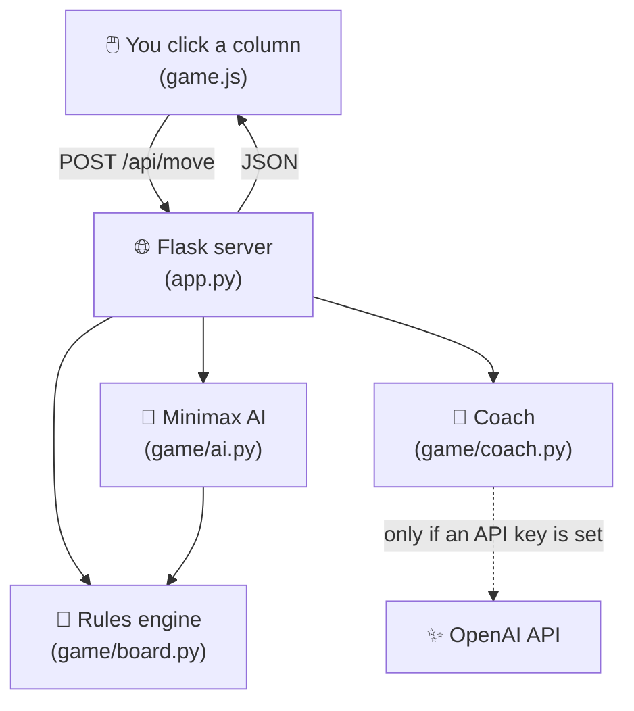
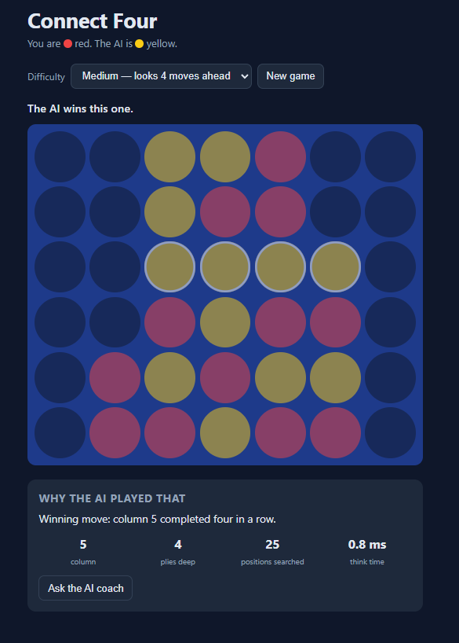

<div align=center>

<h1>🤖 Connect Four AI 👾</h1>

<p>
  <strong>A browser based Connect Four game where the AI opponent thinks before it makes a move!</strong>

Note: While this project was primarily vibe-coded, all code was manually typed, reviewed, and adjusted as needed by myself.
</p>

<p>
  
  
  
</p>

</div>

<br>

<h2 align=center>🤔 How does it work? </h2>

I built this project to develop my Python skills and learn how to create a game where I can play against an AI opponent that uses actual logic before acting.

It's the classic Connect Four game where pieces are dropped into a column, and the first player to get four in a row wins. The twist is that you're playing against a computer opponent that looks several moves into the future** before it decides where to go. It isn't guessing and it isn't following a script. It plays out possible pathways, scores them, and picks the one that works out best for it.

On top of that, there's an optional AI coach that explains why the computer made each move in plain English.

<br>

<h2 align=center>🎮 How to play 🎲</h2>

<table>
  <tr>
    <td>🫡</td>
    <td>Pick a difficulty: <b>Easy</b>, <b>Medium</b>, or <b>Hard</b>.</td>
  </tr>
  <tr>
    <td>📍</td>
    <td>Click any column to drop your red piece.</td>
  </tr>
  <tr>
    <td>🤖</td>
    <td>The AI answers with a yellow piece a split second later.</td>
  </tr>
  <tr>
    <td>📖</td>
    <td>Read the panel under the board to see how many positions the AI checked and why it chose that column.</td>
  </tr>
  <tr>
    <td>🫶🏻</td>
    <td>Click <b>Ask the AI coach</b> if you want a friendlier explanation.</td>
  </tr>
</table>

<br>

<h2 align=center>🧠 How the AI thinks 🧐</h2>

Imagine you're about to make a move. A good player doesn't just ask *"what looks good
right now?"* They ask:

> *"If I go here, what's the smartest thing my opponent could do back?
> And what would I do after that?"*

That's exactly what my AI opponenet does. It uses an algorithm called **minimax**:

- On **its own turn**, it picks the move with the **highest** score.
- On **your turn**, it assumes you'll pick the move that's **worst** for it.

Assuming you'll always play perfectly might sound pessimistic, but it's what makes the AI hard to trick. It never walks into a trap hoping you won't notice.

There are way too many possibilities for wining a game, so it only looks a few moves ahead and then makes an educated guess based off the current board status. The computer is programed to view winning the game in tiers it can understand. It views the rewards as shown below:

<table>
  <tr><th>Pattern on the board</th><th>What the AI thinks about it</th></tr>
  <tr><td>Four in a row</td><td>🏆 A win. Nothing beats this.</td></tr>
  <tr><td>Three in a row with an open space</td><td>👍 One move away from winning</td></tr>
  <tr><td>Two in a row with room to grow</td><td>🙂 A decent start</td></tr>
  <tr><td>Pieces in the middle column</td><td>📍 The center is part of the most winning lines</td></tr>
  <tr><td><b>You</b> having three in a row</td><td>🚨 Danger! Block it — and this matters slightly more than building its own threat</td></tr>
</table>

I also added a speed trick called **alpha-beta pruning**. If the AI already knows a move is good, it stops wasting time on moves that clearly can't beat it. The final choice is exactly the same, it just gets there much faster.

<br>

<h2 align=center>📊 Difficulty levels</h2>

<table>
  <tr>
    <th>Level</th>
    <th>How far ahead it looks</th>
    <th>Positions it checks</th>
    <th>What it feels like</th>
  </tr>
  <tr>
    <td>🟢 Easy</td>
    <td>1 move</td>
    <td>~8</td>
    <td>Makes random moves. Very beatable.</td>
  </tr>
  <tr>
    <td>🟡 Medium</td>
    <td>4 moves</td>
    <td>~500</td>
    <td>Blocks your obvious threats and sets up its own.</td>
  </tr>
  <tr>
    <td>🔴 Hard</td>
    <td>6 moves</td>
    <td>~3,000</td>
    <td>Very tough, the computer views you as a threat.</td>
  </tr>
</table>

<br>

<h2 align=center>🗺️ How the pieces fit 🧩</h2>



I kept each part in its own file with its own job:

<table>
  <tr><th>File</th><th>Its one job</th></tr>
  <tr><td><code>game/board.py</code></td><td>The rules. Is this move legal? Did someone win?</td></tr>
  <tr><td><code>game/ai.py</code></td><td>The brain. Which column should the computer play?</td></tr>
  <tr><td><code>game/coach.py</code></td><td>The explainer. Why did it play that?</td></tr>
  <tr><td><code>app.py</code></td><td>The messenger between the browser and the game.</td></tr>
  <tr><td><code>templates/</code> and <code>static/</code></td><td>What you see and click on.</td></tr>
</table>

The rules file (board.py) doesn't know a website exists at all. This means that the game logic can be tested without starting a server, and I could reuse it for a totally different version of the game later.

<br>

<h2 align=center>🚀 Run it yourself! 🎯</h2>

The quickest way is GitHub Codespaces: click the green **Code** button above →
**Codespaces** → **Create codespace on main**. Everything installs itself.

To run it on your own computer instead:

```bash
git clone <repository URL>
python -m venv .venv
source .venv/bin/activate        
pip install -r requirements.txt
python app.py
```

Then open <b>http://localhost:5000</b> in your browser.

> 💡 **In Codespaces**, `localhost` won't work from your own browser. Go to the
> **Ports** tab at the bottom of VS Code and click the 🌐 globe icon next to port 5000.

<br>

<details>
<summary><b>📚 Words I had to learn while building this (click to open)</b></summary>

<br>

<table>
  <tr><th>Term</th><th>What it means in plain English</th></tr>
  <tr><td><b>Minimax</b></td><td>Pick your best move while assuming your opponent always picks their best move back.</td></tr>
  <tr><td><b>Alpha-beta pruning</b></td><td>Skip checking moves that can't possibly change the final decision.</td></tr>
  <tr><td><b>Heuristic</b></td><td>An educated guess used when calculating the perfect answer would take too long.</td></tr>
  <tr><td><b>Ply</b></td><td>One move by one player. "Looking 4 plies ahead" means my move, your move, my move, your move.</td></tr>
  <tr><td><b>Recursion</b></td><td>A function that calls itself to solve a smaller version of the same problem.</td></tr>
  <tr><td><b>Flask</b></td><td>A Python tool that turns functions into web pages and web addresses.</td></tr>
  <tr><td><b>API route</b></td><td>A web address the browser sends data to, like <code>/api/move</code>.</td></tr>
  <tr><td><b>Session</b></td><td>A small, signed piece of data that remembers your game between clicks, so you can't cheat by editing it.</td></tr>
  <tr><td><b>Environment variable</b></td><td>A setting stored outside the code. It's how secrets like API keys stay out of GitHub.</td></tr>
</table>

</details>

<br>


<h2 align=center>Results 🚩</h2>
 

<div align="center">
  <sub>Thank you for stopping by!</sub>
</div>